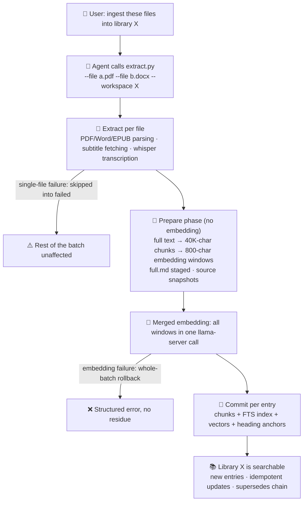
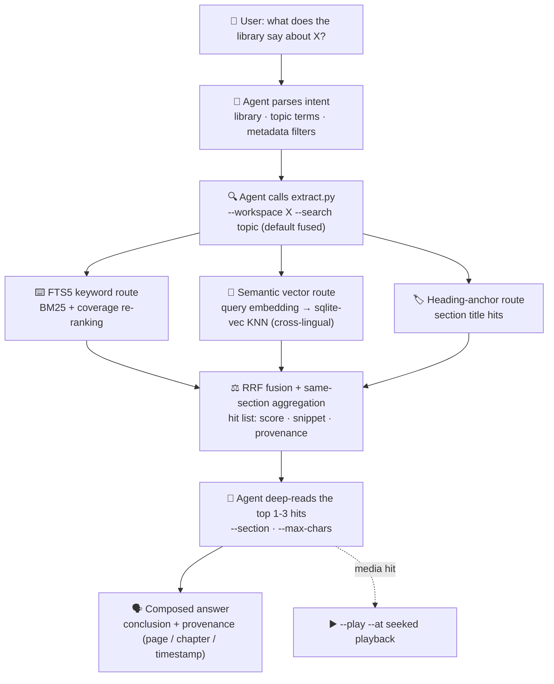

# MyAgentRAG

中文 | [English](README.en.md)


**MyAgentRAG — a local RAG knowledge-base skill designed specifically for AI Agents.**

Embed it into **Claude Code, Codex, OpenCode, pi** or any other skill-capable AI Agent, and the Agent immediately gains a lasting new capability: **turning your scattered materials — videos, web pages, documents, recordings — into a personal knowledge base that's always on call, with answers that carry precise provenance.**

**The knowledge base and the Agent each do what they're best at**: MyAgentRAG does the heavy lifting — extracting and ingesting YouTube/Bilibili videos, web pages, PDF/Word/Excel/PowerPoint/EPUB documents and audio/video recordings (high-accuracy local ASR transcription), then building **three-route aggregated retrieval: full-text keywords + vector semantics + heading anchors** (SQLite FTS5 + a local embedding model, cross-lingual Chinese/English), with every retrieval result anchored to exact provenance (which PDF page, which EPUB chapter, which minute-and-second of a video). The Agent does what it's best at — understanding your question, locating, deep-reading and presenting. A retrieval engine's memory × an Agent's presentation and processing power — together, your personal knowledge base.

It solves the oldest problems every Agent runs into:

- **Private knowledge isn't in the model** — your lecture slides, papers, meeting recordings and saved videos are unknown to the model;
- **Context doesn't fit** — a 300-page PDF stuffed into a chat window either blows the context or gets truncated beyond recognition;
- **Answers have no provenance** — the model answers "from memory" and you cannot verify which page of which document it came from.

All computation happens locally: **no LLM calls, no data leaves your machine**.

---

## What It Can Do: Six Real Scenarios

### ① Build a knowledge base (batch ingest)

> You: "Ingest every PDF from `D:\papers\` into the 'papers' library, and save that Bilibili lecture video too."

The Agent runs one batch ingest: the directory's PDFs are extracted and ingested one by one, the Bilibili video's subtitles are fetched automatically, and all content is embedded in a single merged pass. Re-ingesting the same file is recognized automatically (content-fingerprint idempotency) — no duplicates; when content has changed, the response tells you exactly which new entry supersedes the old one.

```bash
python scripts/extract.py --file a.pdf --file b.docx --file c.epub --workspace papers
python scripts/extract.py --dir "D:\papers" --workspace papers          # whole-directory batch
python scripts/extract.py --url "https://www.bilibili.com/video/BVxxxx" --workspace papers
```

**Ingest flow at a glance**:



Supported sources: **YouTube, Bilibili, web articles, PDF, Word (docx/doc), Excel, PowerPoint, EPUB, plain text**, plus **local speech-to-text transcription of audio/video** (whisper.cpp, offline).

### ② Semantic search: paraphrases still hit

> You: "What does the papers library say about 'model compression'?"

The library looks for answers in three ways at once: **keyword full-text search** (exact matches to the original wording), **semantic vector search** (ask about "model compression" and it also retrieves passages about "knowledge distillation" and "quantization" — cross-lingual Chinese/English works the same way), and **heading anchors** (direct hits on section titles). Results from all three routes are fused and ranked by relevance:

```bash
python scripts/extract.py --workspace papers --search "model compression"
```

**Retrieval recall & presentation flow at a glance**:



Every hit carries: its entry and section title, a highlighted snippet (『』), multi-route score details, and **precise provenance**.

### ③ Trustworthy answers with provenance: down to the page and the second

> You: "Where does this conclusion come from?"

This is the biggest difference from "throwing files at a chat model" — **every retrieval result is anchored to the source structure**:

| Material | Provenance granularity |
| --- | --- |
| PDF | Which page (plus where on the page the term was hit) |
| EPUB / Word | Which chapter, under which heading |
| Audio / video | **From m:ss to m:ss** (precise to the spoken segment containing the hit) |
| Web / text | Which line |

The Agent cites these as it answers, and you can verify every claim.

### ④ Video & recordings: search the content, jump to the moment

> You: "In that lecture I saved, which part covers 'RAG evaluation'? Play it for me."

After retrieval, the Agent gets a second-level timestamp and drives your local player (VLC / PotPlayer / mpv, probed per platform) to **start playback at 12:33** — no scrubbing:

```bash
python scripts/extract.py --workspace lectures --play <entry-id> --at 12:33
```

### ⑤ Very long documents: ask a 300-page book anything

When a single document exceeds 250K characters, the content is automatically chunked to disk (40,000 chars per chunk, paragraph-aligned, checksummed), and the Agent processes it chunk by chunk — **nothing is lost because the document is long**. Ingested long documents support search and deep reading as usual, with read length uniformly governed by `--max-chars`.

### ⑥ Filter by metadata: title, author, date

> You: "Find everything ingested after 2024 whose title contains 'survey'."

```bash
python scripts/extract.py --workspace papers --search "title:survey publish_date>=2024 survey methods"
```

Column filters (`title:` / `author:` / `publisher:` / `publish_date:`) and range filters (`>=` / `<=` / `>` / `<`) constrain all three retrieval routes via candidate entry sets, with the filtered candidate count reported.

### ⑦ Multiple libraries and cross-library search

Different projects can live in different libraries (`--workspace projectA` / `papers` / `lectures`…), fully isolated; one query can also span all libraries at once, annotated per source library. A library is a **self-contained directory** — copying the folder is a complete backup or migration. 13 management operations cover create/list/delete/rename/stats/verify/reindex/vacuum and more.

---

## Quick Start

### Step 1: Install

**Option 1: npm (recommended)**

```bash
npm install @cdexs/myagentrag
```

**Option 2: one-liner for pi users**

```bash
pi install npm:@cdexs/myagentrag
```

The skill lands in `node_modules/@cdexs/myagentrag/`; place it into your Agent's skill directory (e.g. `~/.pi/agent/skills/myagentrag`, or the skill directories of Claude Code / Codex / OpenCode).

**Option 3: from source**

```bash
git clone https://github.com/Cdexs/myagentrag.git
```

Put the repo into your Agent's skill directory, or run the commands below inside it.

### Step 2: what happens on first use

- **No Python libraries to pre-install**: the bootstrap layer only needs Python ≥3.8 (standard library);
- On first use the skill installs its **dedicated runtime** (a standalone CPython 3.12 + version-pinned libraries, ~150 MB, after your confirmation) — fully isolated from the system Python;
- For transcription it will list ffmpeg / whisper.cpp / speech model requirements (~1.6–2.4 GB, after confirmation);
- Everything lives under `~/.myagentrag/` — no system directories touched; uninstalling means deleting that folder.

### Step 3: start using

Once installed into the Agent, **just talk to it in natural language** (this is a skill designed for Agents — conversation is the primary interface):

| You say | The Agent does |
| --- | --- |
| "Ingest these PDFs into the 'papers' library" | Batch extract + ingest (merged embeddings, one pass) |
| "What does the papers library say about model compression?" | Hybrid search → hit list → deep-read the top section → answer with provenance |
| "What does clause 14 actually say?" | Heading-anchor location → full-section deep read |
| "Where in that video is RAG evaluation covered?" | Search → second-level timestamp → seeked playback |
| "What's in the knowledge base?" | Entry listing and stats inventory |

The underlying commands (also usable directly in a terminal):

```bash
python scripts/extract.py --file document.pdf --workspace my-docs            # extract + ingest
python scripts/extract.py --dir docs-folder --workspace my-docs              # batch ingest
python scripts/extract.py --workspace my-docs --search "keyword"             # three-route hybrid search
python scripts/extract.py --workspace my-docs --entry <id> --max-chars 8000  # located deep reading
python scripts/extract.py --workspace my-docs --play <id> --at 12:33         # seeked playback
```

### Cookies for restricted content

Bilibili's AI subtitles and login-walled videos, and some YouTube videos, need a logged-in session: export Netscape cookies with a browser extension (e.g. Get cookies.txt LOCALLY) and place them under `~/.myagentrag/cookies/` as prompted. The skill **never auto-creates or collects cookies**; public content needs no login at all. See the Cookies section below for details.

---

## Runtime Environment & Dependencies

| Feature | Dependency | Notes |
| --- | --- | --- |
| Bootstrap | **Python ≥3.8** (standard library only) | Launches the skill and manages the dedicated runtime |
| Extraction & ingestion | **Dedicated runtime** (auto-installed) | Standalone CPython 3.12 + pinned libraries, ~150 MB, fully isolated |
| Restricted YouTube content | **Node.js** (`node` on PATH) | Required as JS runtime by yt-dlp |
| Word `.doc` (legacy) | **pandoc** (on PATH) | Only for this format, not auto-downloaded |
| Audio/video transcription | **ffmpeg + whisper-cli + ggml model** | ~1.6–2.4 GB, auto-downloaded into `~/.myagentrag/` after confirmation |

All components require **no pre-installation** — detected on first use and installed after confirmation; extension libraries ship with the dedicated runtime, versions test-locked, never touching the user's system Python.

## Environment Variables

| Variable | Purpose |
| --- | --- |
| `MYAGENTRAG_PYTHON` | Python interpreter (defaults to `python` on PATH) |
| `MYAGENTRAG_HOME` | Managed component directory (default `~/.myagentrag`) |
| `MYAGENTRAG_TMPDIR` | Temp directory (defaults to `~/.myagentrag/tmp` — never touches the system temp dir; can point to another disk) |
| `MYAGENTRAG_FFMPEG` | Path to the ffmpeg executable |
| `MYAGENTRAG_WHISPERCPP_CLI` | Path to the whisper-cli executable |
| `MYAGENTRAG_WHISPERCPP_DIR` | Search directory for whisper.cpp executables |
| `MYAGENTRAG_WHISPERCPP_MODELS_DIR` | GGML model directory |
| `MYAGENTRAG_YOUTUBE_COOKIES` | YouTube cookies file (defaults to `~/.myagentrag/cookies/youtube-cookies.txt`) |
| `MYAGENTRAG_WHISPERCPP_CMAKE_FLAGS` | Extra CMake flags when building whisper.cpp from source |
| `MYAGENTRAG_WORKSPACES_DIR` | Knowledge-base workspace root (default `~/.myagentrag/workspaces/`) |
| `MYAGENTRAG_LANG` | Feedback language zh/en (`--lang` flag wins) |
| `MYAGENTRAG_PIP_INDEX_URL` | pip mirror for the dedicated runtime install |
| `MYAGENTRAG_PYTHON_MIRROR` | Mirror for the runtime CPython download (default: GitHub Releases) |

## The Knowledge-Base Workspace

A knowledge base is organized as a workspace — a **self-contained directory**:

```
~/.myagentrag/workspaces/<library>/
├── workspace.db            # SQLite (WAL mode): entries / chunks / FTS index / vectors
├── source/<entry-id>/      # Original source snapshot (media / web snapshot / subtitle files)
└── entries/<entry-id>/
    ├── meta.json           # Metadata (title/source/author/publication/chunk count)
    ├── full.md             # Full extracted text (hits deep-read by offset)
    └── transcript.json     # Audio/video segment-level timestamps (with char ranges in full.md)
```

**Hybrid retrieval (default fused)**: a semantic vector route (Qwen3-Embedding, cross-lingual), an FTS5 keyword route and a heading-anchor route run in parallel, fused by RRF. Every hit carries `score_source` (which routes hit it), a `snippet` (『』highlight), `heading` (its section), `section_ref` (deep-read reference) and `source_loc` (source provenance).

**Granularity**: content is stored as 40,000-char chunks (paragraph-aligned, 300-char overlap between neighboring chunks); embedding vectors use 800-char windows (100-char overlap, 700-char step, one vector per window); audio/video entries are additionally indexed by whisper segment-level timestamps — seek/playback precision is paragraph-level, independent of chunking.

**Query syntax**: terms of ≥3 chars enter the trigram index (natural multi-word defaults to OR recall + coverage re-ranking); `AND` / `OR` / `NOT` / `NEAR(a b, 5)` / `prefix*` pass through; `<3`-char Chinese terms fall back to low-precision LIKE, flagged in results. On zero hits, rephrase or retry with `--mode vector` (the semantic route crosses languages).

**Result depth**: `--limit` (default 20, max 100) caps returned hits; raise it (e.g. `--limit 50`) for enumeration, comparison and broad cross-library scenarios. Fewer hits than the limit is normal (same-section aggregation).

Full management operations, reading and playback details: see [SKILL.md](SKILL.md).

## Cookies (restricted YouTube / Bilibili content ingestion)

No cookies are needed for normal use. Only when the script says so (the `cookieHint` field in the returned JSON):

**YouTube**:

1. Install the browser extension **Get cookies.txt LOCALLY** (or similar);
2. Visit youtube.com, log in, and export cookies in Netscape format;
3. Save to: `~/.myagentrag/cookies/youtube-cookies.txt` (on Windows: `C:\Users\<you>\.myagentrag\cookies\`);
4. Re-run the same command.

**Bilibili**: AI auto-subtitles and login-walled videos need a logged-in session — export bilibili.com cookies the same way and save to `~/.myagentrag/cookies/bilibili-cookies.txt` (`MYAGENTRAG_BILIBILI_COOKIES` points to any path; raw Cookie-header-style files are also accepted).

The skill **never auto-creates, collects or uploads cookies**; cookies carry account-session privileges — never commit them to a repository or share them.

## License

Released under the [MIT License](LICENSE) — Copyright (c) 2026 Sightview.
