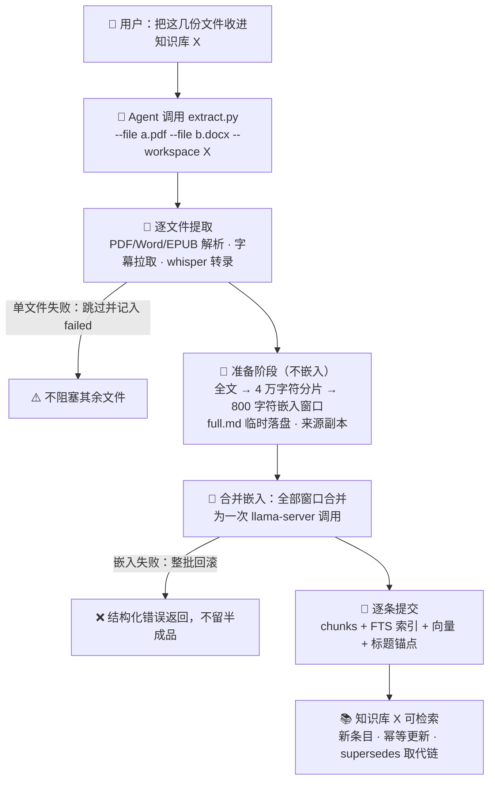
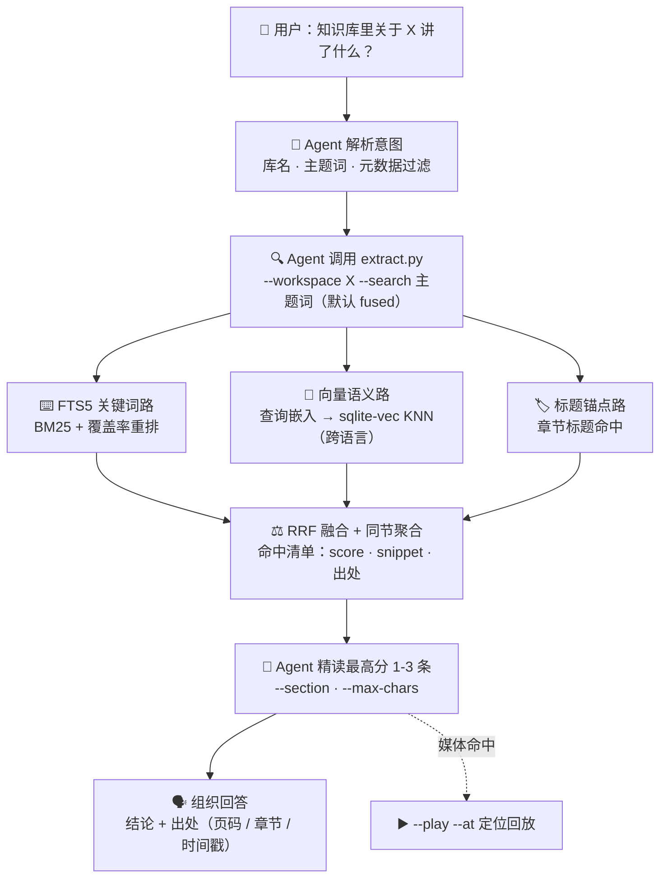

# MyAgentRAG

[English](README.en.md) | 中文


**MyAgentRAG —— 专为 AI Agent 设计的本地 RAG 知识库技能（Agent Skill）。**

把它嵌入 **Claude Code、Codex、OpenCode、pi** 等支持技能机制的 AI Agent，Agent 立刻获得一项持久的新能力：**把你散落各处的资料——视频、网页、文档、录音——变成一个随叫随到、答案带出处的个人专属知识库**。

**知识库与 Agent 各司其职**：MyAgentRAG 负责重活——把 YouTube/B站视频、网页、PDF/Word/Excel/PowerPoint/EPUB 等文档与音视频录音（本地 ASR 高精度转写）提取入库，建好**文本关键词 + 向量语义 + 标题锚点三路聚合检索**（SQLite FTS5 + 本地向量模型，中英文跨语言），并给每条检索结果锚定精确出处（PDF 第几页、EPUB 第几章、视频第几分几秒）；Agent 负责它最擅长的事——理解你的问题、检索定位、精读消化、组织呈现。检索引擎的记忆力 × Agent 的展现与处理能力，合起来就是你的个人专属知识库。

它解决的是所有 Agent 都会遇到的老问题：

- **私有知识不在模型里**——你的课件、论文、会议录音、收藏的视频，模型一无所知；
- **上下文装不下**——一本 300 页的 PDF 塞进对话窗口，要么爆掉要么被截断失真；
- **回答没有出处**——模型"凭记忆"作答，你无法核实它说的是哪份资料的哪一页。

全部计算在本地完成，**不调用任何 LLM、数据不出本机**。

---

## 它能做什么：六个真实场景

### ① 把资料收进知识库（批量入库）

> 你："把 `D:\论文\` 这个目录里的 PDF 都收进'论文库'，再把 B站 那个讲座视频也存进去。"

Agent 调用一次批量入库：整个目录的 PDF 逐个提取入库，B站 视频自动拉取字幕，所有内容合并为一次向量化。同一份文件重复入库会自动识别（内容指纹幂等），不会产生重复条目；内容改过再入库时，会明确告诉你旧版本被哪个新条目取代。

```bash
python scripts/extract.py --file a.pdf --file b.docx --file c.epub --workspace 论文库
python scripts/extract.py --dir "D:\论文" --workspace 论文库          # 整目录批量
python scripts/extract.py --url "https://www.bilibili.com/video/BVxxxx" --workspace 论文库
```

**入库流程一览**：



支持的内容源：**YouTube、B站、网页正文、PDF、Word（docx/doc）、Excel、PowerPoint、EPUB、纯文本**，以及 **音频/视频的本地语音转录**（whisper.cpp，无人值守离线转写）。

### ② 语义检索：换一种说法也能命中

> 你："论文库里关于'模型压缩'都讲了什么？"

知识库同时用三种方式找答案：**关键词全文检索**（精确命中原文用词）、**向量语义检索**（你问"模型压缩"，它能把讲"知识蒸馏"、"量化剪枝"的段落也找回来——中英文跨语言同理）、**标题锚点**（直接命中章节标题）。三路结果融合排序，答案按相关度呈现：

```bash
python scripts/extract.py --workspace 论文库 --search "模型压缩"
```

**检索召回与展现流程一览**：



每条命中都带：所属条目与章节标题、原文摘要片段（『』高亮）、多路得分明细，以及**精确出处**。

### ③ 带出处的可信回答：精确到页码和秒

> 你："这个结论出自哪里？"

这是 MyAgentRAG 与"把文件丢给聊天模型"最大的差别——**每条检索结果都锚定源文件结构**：

| 资料类型 | 出处粒度 |
| --- | --- |
| PDF | 第几页（含命中词在页内的位置） |
| EPUB / Word | 第几章、哪个标题下 |
| 音频 / 视频 | **第几分几秒到第几分几秒**（精确到命中词所在的语音段落） |
| 网页 / 文本 | 第几行 |

Agent 引用这些出处作答，你可以逐条核实。

### ④ 视频与录音：检索到片段，点击即定位播放

> 你："上次存的那个讲座里，讲'RAG 评估'的是哪一段？放给我看。"

Agent 检索命中后拿到秒级时间戳，**用内置的 ffplay 从第 12 分 33 秒起播**——不依赖你装没装播放器（ffplay 随组件包一并落盘），也不走系统默认关联：

```bash
python scripts/extract.py --workspace 讲座库 --play <entry-id> --at 12:33
```

命中结果还带一个可点击的 `locator`：媒体命中给 `myagentrag://play?…` 链接（点击即定位播放），文档命中给 `file:///` 打开原文件的链接 + 页码/章节标注（各阅读器不支持深链，故只承诺"打开原文件"，页码以文字并列给出）。

### ⑤ 超长文档：几百页的书也能问

单个文档超过 25 万字符时，内容自动分片落盘（每片 4 万字符、段落边界对齐、带校验和），Agent 按清单逐片处理，**不会因为文档太长而丢内容**。入库后超长文档的检索与精读同样可用，读取长度由 `--max-chars` 统一控制。

### ⑥ 按条件筛查：标题、作者、日期

> 你："找一下 2024 年之后入库的、标题带'综述'的资料。"

```bash
python scripts/extract.py --workspace 论文库 --search "title:综述 publish_date>=2024 综述方法"
```

列限定（`title:` / `author:` / `publisher:` / `publish_date:`）与范围过滤（`>=` / `<=` / `>` / `<`）以候选条目集约束三种检索方式同时参与，结果标注过滤后的候选条目数。

### ⑦ 多库管理与跨库检索

不同项目、不同主题可以各建各的库（`--workspace 项目A` / `论文库` / `讲座库`……），互不干扰；一个查询也可以横跨全部库检索，结果标注来自哪个库。库是**自包含目录**——拷走整个文件夹就完成了备份或迁移。增删改查、重命名、统计、完整性校验、索引重建、空间回收等 13 项管理操作齐备。

---

## 快速开始

### 第一步：安装

**方式一：npm 安装（推荐）**

```bash
npm install @cdexs/myagentrag
```

**方式二：pi 用户一键安装**

```bash
pi install npm:@cdexs/myagentrag
```

安装后技能包位于 `node_modules/@cdexs/myagentrag/`，把它放进 Agent 的技能目录（如 `~/.pi/agent/skills/myagentrag`、Claude Code / Codex / OpenCode 的技能目录）即可。

**方式三：从源码安装**

```bash
git clone https://github.com/Cdexs/myagentrag.git
```

把仓库目录放进 Agent 的技能目录，或直接在仓库内运行下述命令。

### 第二步：首次使用会发生什么

- **无需预装任何 Python 库**：引导层只要机器上有 Python ≥3.8（仅标准库）即可；
- 首次使用时技能会自动安装**专用运行时**（独立 CPython 3.12 + 版本锁定的扩展库，约 150 MB，经你确认后下载），与系统 Python 完全隔离，不污染用户环境；
- 用到音视频转录时，会再列出 ffmpeg / whisper.cpp / 语音模型的清单（约 1.6–2.4 GB，经确认后下载）；
- 所有组件都装在 `~/.myagentrag/` 用户目录下，不动系统目录，卸载只需删除该目录；
- 安装 ffmpeg 组件时**自动注册 `myagentrag://` 播放链接协议**（用户级注册表，仅 skill 自有命名空间——不修改你的系统默认播放器与文件关联；`--unregister-protocol` 可完全移除）。

### 第三步：开始使用

安装到 Agent 后，**直接对 Agent 说自然语言**即可（这是设计给 Agent 的技能，对话是主要用法）：

| 你对 Agent 说 | Agent 背后做的事 |
| --- | --- |
| "把这几份 PDF 收进'论文库'" | 批量提取入库（合并嵌入，一次完成） |
| "论文库里关于模型压缩讲了什么？" | 三路混合检索 → 命中清单 → 精读最高分章节 → 带出处回答 |
| "第 14 条具体讲了什么？" | 标题锚点定位 → 整节精读 |
| "那个视频里讲 RAG 评估的片段在哪？" | 检索 → 秒级时间戳 → 定位回放 |
| "知识库里都有什么资料？" | 条目清单与统计盘点 |

对应的底层命令（也可直接在终端使用）：

```bash
python scripts/extract.py --file document.pdf --workspace 我的资料            # 提取并入库
python scripts/extract.py --dir 资料目录 --workspace 我的资料                  # 批量入库
python scripts/extract.py --workspace 我的资料 --search "检索词"              # 三路混合检索
python scripts/extract.py --workspace 我的资料 --entry <id> --max-chars 8000  # 定位精读
python scripts/extract.py --workspace 我的资料 --play <id> --at 12:33         # 音视频定位回放
```

### 受限内容需要 Cookies

B站 的 AI 自动字幕、登录墙视频，YouTube 的部分视频需要登录态：用浏览器扩展（如 Get cookies.txt LOCALLY）导出 Netscape 格式 cookies，按提示放到 `~/.myagentrag/cookies/` 下即可。技能**永不自动创建或收集 cookies**，公开内容完全免登录。详见下文 Cookies 一节。

---

## 运行环境与依赖组件

| 功能 | 依赖 | 说明 |
| --- | --- | --- |
| 引导启动 | **Python ≥3.8**（仅标准库） | 启动技能并管理专用运行时 |
| 提取与入库 | **专用运行时**（自动安装） | 独立 CPython 3.12 + 锁定扩展库，约 150 MB，与系统 Python 零接触 |
| YouTube 受限内容 | **Node.js**（`node` 在 PATH） | yt-dlp 需要 JS 运行时 |
| Word `.doc`（老格式） | **pandoc**（PATH） | 仅此格式需要，不自动下载 |
| 音视频转录入库 | **ffmpeg + whisper-cli + ggml 模型** | 约 1.6–2.4 GB，经确认后自动下载到 `~/.myagentrag/` |

所有组件**无需预先安装**——首次用到时自动检测，经确认后代为安装；扩展库全部随专用运行时预装，版本经过测试锁定，与用户系统 Python 零接触。

## 环境变量

| 变量 | 作用 |
| --- | --- |
| `MYAGENTRAG_PYTHON` | 指定 Python 解释器（默认 PATH 中的 `python`） |
| `MYAGENTRAG_HOME` | 受管组件目录（默认 `~/.myagentrag`） |
| `MYAGENTRAG_TMPDIR` | 临时目录（默认 `~/.myagentrag/tmp`，不占用系统临时目录；可指向其他磁盘） |
| `MYAGENTRAG_FFMPEG` | 指定 ffmpeg 可执行文件 |
| `MYAGENTRAG_FFPLAY` | 指定 ffplay 可执行文件（`--play` 内置定位播放；默认随 ffmpeg 发行包落盘） |
| `MYAGENTRAG_SKILL_DIR` | 技能根目录（myagentrag:// 链接启动器解析用；移动技能目录后设置即恢复，无需重注册） |
| `MYAGENTRAG_WHISPERCPP_CLI` | 指定 whisper-cli 可执行文件 |
| `MYAGENTRAG_WHISPERCPP_DIR` | whisper.cpp 可执行文件搜索目录 |
| `MYAGENTRAG_WHISPERCPP_MODELS_DIR` | ggml 模型目录 |
| `MYAGENTRAG_YOUTUBE_COOKIES` | YouTube cookies 文件（默认 `~/.myagentrag/cookies/youtube-cookies.txt`） |
| `MYAGENTRAG_WHISPERCPP_CMAKE_FLAGS` | 源码构建 whisper.cpp 时追加的 CMake 参数 |
| `MYAGENTRAG_WORKSPACES_DIR` | 知识库 workspace 根目录（默认 `~/.myagentrag/workspaces/`） |
| `MYAGENTRAG_LANG` | 反馈语言 zh/en（`--lang` 参数优先） |
| `MYAGENTRAG_PIP_INDEX_URL` | 专用运行时装库的 pip 镜像（国内建议清华源） |
| `MYAGENTRAG_PYTHON_MIRROR` | 专用运行时 Python 本体下载源镜像（默认 GitHub Release） |

## 知识库 workspace

知识库以 workspace 为单位组织，每个库是一个**自包含目录**：

```
~/.myagentrag/workspaces/<库名>/
├── workspace.db            # SQLite（WAL 模式）：entries / chunks / FTS 全文索引 / 向量
├── source/<entry-id>/      # 原始来源副本（音视频/网页快照/字幕原始文件）
└── entries/<entry-id>/
    ├── meta.json           # 元数据（标题/来源/作者/出版信息/分片数）
    ├── full.md             # 全量提取文本（检索命中按偏移精读）
    └── transcript.json     # 音视频段级时间戳（含每段在 full.md 中的字符区间）
```

**混合检索（默认 fused）**：语义向量路（Qwen3-Embedding，中英文跨语言）、FTS5 关键词路、标题锚点路三路并行，RRF 融合排序。每条命中带 `score_source`（命中来自哪几路）、`snippet`（『』高亮片段）、`heading`（所在章节）、`section_ref`（精读引用）与 `source_loc`（源文件出处）。

**粒度说明**：内容按 40,000 字符分片入库（段落边界对齐，相邻分片重叠 300 字符）；嵌入向量粒度为 800 字符窗口（相邻窗口重叠 100 字符，步长 700，一窗口一向量）；音视频条目另按 whisper 段级时间戳索引——定位与回放精度为段落级，与分片粒度无关。

**查询语法**：≥3 字词进 trigram 索引（自然多词默认 OR 召回 + 覆盖率重排）；`AND` / `OR` / `NOT` / `NEAR(a b, 5)` / `前缀*` 原样透传；`<3` 字中文词自动回退低精度 LIKE 并标注。检索零命中时换词或 `--mode vector` 重试（语义路可跨语言）。

**检索深度**：`--limit`（默认 20，上限 100）控制返回条数；枚举/清点/多实体对比/宽泛跨库场景建议显式调大（如 `--limit 50`）。命中数可能少于 limit 属正常（同章节碎片聚合）。

完整的管理操作全集、读取与回放细节见 [SKILL.md](SKILL.md)。

## Cookies（YouTube / B站 受限内容入库）

平时完全不需要 cookies。只有当脚本提示需要时（返回 JSON 中的 `cookieHint` 字段）：

**YouTube**：

1. 浏览器安装扩展 **Get cookies.txt LOCALLY**（或同类）；
2. 访问 youtube.com 并登录，导出 Netscape 格式 cookies；
3. 保存到：`~/.myagentrag/cookies/youtube-cookies.txt`（Windows 即 `C:\Users\<你>\.myagentrag\cookies\`）；
4. 重新运行同一命令即可。

**B站**：AI 自动字幕、登录墙视频需要登录态——同样导出 bilibili.com 的 cookies 保存到 `~/.myagentrag/cookies/bilibili-cookies.txt`（`MYAGENTRAG_BILIBILI_COOKIES` 可指定任意路径，也支持原生 Cookie 头格式文件）。

技能**永不自动创建、收集或上传 cookies**；cookies 具有账号会话权限，请勿提交到仓库或共享。

## 许可证（License）

本项目基于 [MIT License](LICENSE) 开源，Copyright (c) 2026 Sightview。
